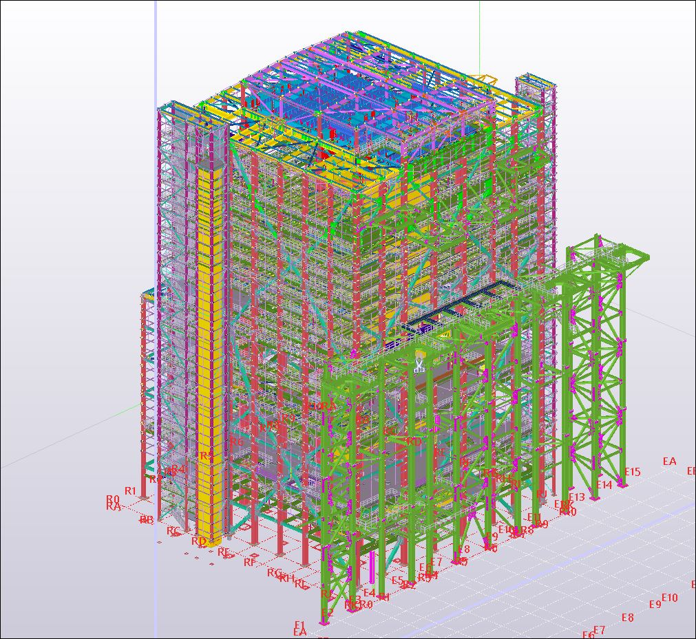

# Tech Projects

## Fraud Detection

Now a days lots of fraud's going on in the market. This project allows business to detect unauthorised transactions and prevent it from happening.

# Structural Engineering Projects

## Andritz Liansheng Recovery Boiler Structure

> * Based on Chinese Code
> * Connection design of boiler structure.
> * Checking of Fabrication and erection drawings.
> * Lifting analysis of truss assemblies
 

## Arcelor Mittal’s Reconstruction of Coke Oven Batteries By-product Plant. (Gijon, Sapin)
> Client-Paul Wurth
> * Based on European code and standards 
> * Design of Piperacks and Primary Gas cooler structure.
> * The scope of project is basic & detail design of steel structures as per Eurocode.
> * Connection design as per Eurocode
> * Coordination with interdisciplinary department to fulfil project & design need.
> * Checking of general arrangement drawings.
 

